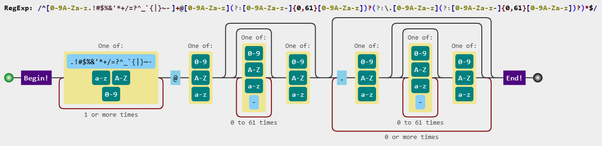

.. _usage:

Direct Function Calls
=====================

By default, all requests are sent from the email address info@filterdns.net,
project is not publicly associated with this company or service, but is simply
used as an existing email address.
You also have the option to manage the sending address, but if it is not explicitly
specified, all requests will go through by default.

verify_email_syntax
-------------------
Example for syntax verification: 
(Uses an improved email regular expression pattern 
(improved to be more RFC 5322 compliant))

Example:

.. code-block:: Python

    from email_multi_check import verify_email_syntax

    # Syntax verification
    result = verify_email_syntax("test@gmail.com")
    if result:
        print(result)
    else:
        print("Valid syntax")

verify_email
------------
You can select all ports ``25``, ``2525``, ``587``, and ``465``, 
but keep in mind that the request is executed synchronously,
and the mail server's response can take up to ``15 seconds`` on average for each port.

Example:

.. code-block:: Python

    from email_multi_check import verify_email

    # Full verification using all methods on specified ports
    results = verify_email(
        email="test@gmail.com",
        sender_email="info@filterdns.net",
        ports=[25, 587]
    )
    for result in results:
        print(result)

A full check is not practical in most cases, but it can be used to test the MX server using all methods.

Example:

.. code-block:: Python

    from email_multi_check import verify_email
    from typing import List

    def full_check(
        email: str,
        sender: str = "info@filterdns.net",
        ports: List[int] | None = None
    ) -> None:
        ports = ports or [25, 587, 2525, 465]
        print(f"\nCheck MAIL FROM for: {email}")
        print(f"Sender: {sender} | Port: {ports}")
        print("=" * 70)
        results = verify_email(
            email=email,
            sender_email=sender,
            ports=ports
        )
        for i, result in enumerate(results, 1):
            print(f"Status: {'Succes' if result.status else 'Error'}")
            print(f"Message: {result.message}")
            if result.method_code:
                print(f"Code: {result.method_code}")
            if result.smtplib_code:
                print(f"SMTP Code: {result.smtplib_code}")
            if result.web_auth_code:
                print(f"Web Code: {result.web_auth_code}")
            if result.MX:
                print(f"MX: {', '.join(result.MX[:2])}{'...' if len(result.MX) > 2 else ''}")
            if result.data and "code" not in result.data:
                print(f"Data: {result.data[:100]}...")
                
        print("-" * 70)
        print(f"\nTotal: {len(results)}")
        valid = sum(1 for r in results if r.status)
        print(f"Succes: {valid}, Fails: {len(results) - valid}")

    full_check("test@gmail.com")    

verify_email_domain
-------------------

Checking the domain for IDNA encoding errors and checking MX records.

Example:

.. code-block:: Python

    from email_multi_check import verify_email_domain

    # Domain verification
    valid, mx_servers = verify_email_domain("test@gmail.com")
    print({"valid": valid, "mx_servers": mx_servers})

verify_email_rcpt
-----------------
Verify email using EHLO + RCPT method.

.. code-block:: Python

    from email_multi_check import verify_email_domain, verify_email_rcpt

    def check_rcpt(
        email: str,
        sender: str = "info@filterdns.net",
        port: int = 465
        ):
        domain_ok, mx_list = verify_email_domain(email)
        if not domain_ok:
            print(f"Error: no MX for {email}")
            return
        print(f"MX found: {mx_list}")
        result = verify_email_rcpt(email, sender, mx_list, port)
        print(f"RCPT result: {result.status} — {result.message}")

    check_rcpt("test@gmail.com")

verify_email_expn
-----------------
Verify email using EXPN method.

.. code-block:: Python

    from email_multi_check import verify_email_domain, verify_email_expn

    def check_expn(
        email: str,
        sender: str = "info@filterdns.net",
        port: int = 25
        ):
        domain_ok, mx_list = verify_email_domain(email)
        if not domain_ok:
            print(f"Error: no MX for {email}")
            return
        print(f"MX found: {mx_list}")
        result = verify_email_expn(email, sender, mx_list, port)
        print(f"EXPN result: {result.status} — {result.message}")
        
    check_expn("test@gmail.com")

verify_email_mail_from
----------------------
Verify email using MAIL FROM / RCPT TO with RSET.

.. code-block:: Python

    from email_multi_check import verify_email_domain, verify_email_mail_from
    from typing import List

    def check_mail_from(
        email: str,
        sender: str = "info@filterdns.net",
        port: int = 25,
        mx_servers: List[str] | None = None
    ) -> None:
        print(f"\nCheck MAIL FROM for: {email}")
        print(f"Sender: {sender} | Port: {port}")
        if mx_servers is None:
            domain_ok, mx_list = verify_email_domain(email)
            if not domain_ok:
                print("Error: Domain not found MX.")
                return
            mx_servers = mx_list
            print(f"MX fount: {mx_servers}")
        else:
            print(f"Set MX: {mx_servers}")
        result = verify_email_mail_from(email, sender, mx_servers, port)
        print(f"EXPN result: {result.status} — {result.message}")

    check_mail_from(email="test@gmail.com", sender="check@filterdns.net", port=25)

verify_email_web_auth
---------------------

Implemented web check for servers that may send false responses to non-existent mailboxes.
First, you need to create a configuration file ``url.cfg`` with a list of servers in the following format:

.. code-block:: xml

    [mail.ru]
    user_exists_url=https://account.mail.ru/api/v1/user/exists
    requests_file=mail.ru_requests

    [yandex.ru]
    user_exists_url=https://passport.yandex.ru/auth/check
    requests_file=yandex.ru_requests 

After which you need to create a file with the query parameters, for example ``mail.ru_requests`` or ``yandex.ru_requests``.
The file name is defined by the ``requests_file=`` parameter in the ``url.cfg`` file.

.. code-block:: xml
    
    [method]
    type=GET

    [headers]
    User-Agent=Mozilla/5.0 (Windows NT 10.0; Win64; x64) AppleWebKit/537.36 (KHTML, like Gecko) Chrome/120.0.0.0 Safari/537.36
    Accept=application/json

    [params]
    email={email}

Example:

.. code-block:: Python

    from email_multi_check import verify_email_web_auth

    # Web-based verification
    result = verify_email_web_auth("test@mail.ru")
    print(result)